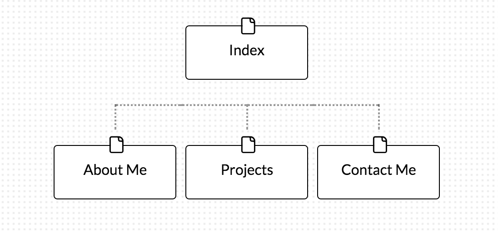

#Desgin Reflection

##Here is my site map.

###What are the 6 Phases of Web Design?
The 6 Phases of Web Design include Information Gathering, Planning, Design, Development, Testing and Delivery, and Maintenance. Information Gathering is about understanding the person/company for whom the site is being created and why the site is being created like the purpose, goals, target audience, and content. Planning involved creating an outline of your website, such as a site map. Design involves deciding on and creating the look and feel of your website, taking into consideration the user experience. Development involves the actual creation and HTML/CSS coding of your website. Testing and Delivery will involve testing the site for functionality and compatibility before uploading it to the server. Finally is maintenance of the site for future changes and additions, as well as compatibility issues.

###What is your site's primary goal or purpose? What kind of content will your site feature?
The primary purpose of the website is to be professional website demonstrating my experience, abilities, and previous projects. It will tell potential employers more about myself, my work experience, my projects, a link to my blog, and ways to contact me.

###What is your target audience's interests and how do you see your site addressing them?
My target audience's interest are my abilities to either do or quickly learn and adapt to the coding responsibilities of the job position, my personal tech interest, and how I will fit in with company culture. The site will address the first concerns through my projects and experience and the about me description will help them understand if I will fit in with the company culture.

###What is the primary "action" the user should take when coming to your site? Do you want them to search for information, contact you, or see your portfolio? It's ok to have several actions at once, or different actions for different kinds of visitors.
Their primary action should be to browse my experience and projects. The home page should have a preview of everything that compels the reader to read more with a simple click through a clearly designed site. The site will be easy to navigate and allow the reader to view exactly what they want. The hope is through reading relevant information on the site, the user will reach out to me. By separating the different information it will allow differnt users to see only what they want and not have to search hard for it.

###What are the main things someone should know about design and user experience?
There are many things one could understand and research in relation to design and user experience, and still will not everything. The most important things are who will be interacting with you site and how they will interact with it. You must take into consideration a color palette that looks good together, a font set that doesn't utilize too many different fonts, and the layout of your site. You also want to make sure your site can be viewed on devices of different sizes and resolutions. You also want to think about how the user will navigate the site and make sure it is clear, coherent, and simple.

###What is user experience design and why is it valuable?
User experience design is designing a site with the users interactions being a primary focus of the design. It is valuable because the more inviting and easy to navigate a site is, the more likely the user will interact and utilize the site in the way the owner of the site would like.

###Which parts of the challenge did you find tedious?
Reading all the different information about user experience was pretty tedious. A lot of it was very interesting, but seeing just how much goes into designing a great user experience became a bit overwhelming after a while. I do know that it will come in handy later on and something I will be thinking about.