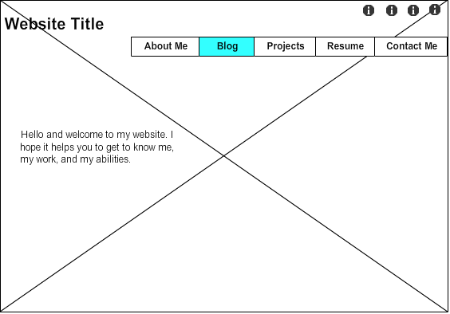
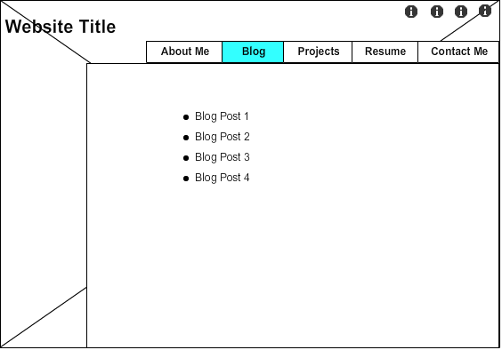

#Wireframe Reflection

###What is a wireframe?
A wireframe is a map or a simpe guide design of your website. It can be really simple or detailed depending on what helps the designer build the website.

###What are the benefits of wireframing?
Wireframing allows you to plan a site out before development begins. This helps to best utilize the developer time, as well as begin to understand how the site should interact.

###Did you enjoy wireframing your site?
It was a bit difficult at first to start planning it out, but once I started to place some of the pieces, it started to come together. I definitely think its a beneficial practice and a way I would've wanted to start the design process.

###Did you revise your wireframe or stick with your first idea?
I made small revisions, but stuck with my general original idea. Once I started trying ideas things started to come together and my wireframe became more coherent.

###What questions did you ask during this challenge? What resources did you find to help you answer them?
I asked what would make an interesting and appealing website. I also thought what would keep it simple and easy to navigate. I thought the articles provided as well as taking a look at different sites gave me some ideas and insight as to what might make an appealing site.

###Which parts of the challenge did you enjoy and which parts did you find tedious?
Some of the reading was very long and a bit tedious. The wireframing felt a bit tedious at first, but once I got going and my ideas were flowing it became fun.