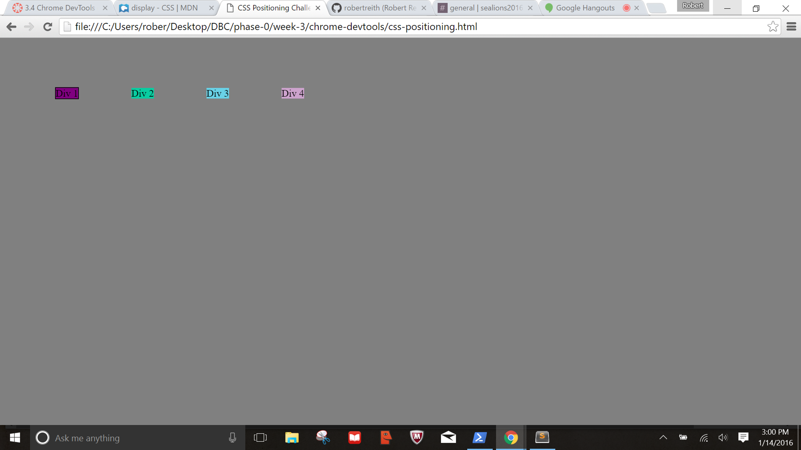

#Positioning Reflection

###How can you use Chrome's DevTools inspector to help you format or position elements?
Chrome's DevTools allows you to visual see your html code, css code, and the visual representation of them all at the same time. It also allows you to alter the code and see the changes in real time without affecting the source code. This allows you to change the structure of your html of your css. You can click in to any of it and change tags, classes, id's, links, and content. In CSS you can alter anything from the positioning to color, to font size, margin, and immediately see it take affect to make your site look the way you imagine it should. Once you find what works you can implement it into your source code.

###How can you resize elements on the DOM using CSS?
There are many ways to resize an element using your CSS on the DOM. The best way is to use your height and width elements. You can change it to either a pixel size by using px. You can change it to a more standard size using em. Or you can make it a percentage of the screen size. The last two may work better across screens of different sizes and resolutions to make sure your site is still displayed the same.

###What are the differences between absolute, fixed, static, and relative positioning? Which did you find easiest to use? Which was most difficult?
- Absolute element scrolls with the page.
- Fixed positioned elements do not move when a page is scrolled. They stay in the same place.
- Static positioned elements are not affected by top, bottom, left, right properties.
-Relative positioned elements are adjusted based on their normal position (left, right, top, bottom).
- Fixed was the easiest to understand and implement. Relative elements are the ones that I am still working to understand, but I beleive with this lesson and the more I play around with them, the easier to understand they will become.

###What are the differences between margin, border, and padding?
- Margin: Adjust the white space outside of the borders
- Border: Allows elements to be fully inclosed as well as vertical and horizontal lines to a page
- Padding: Adjusts the white space inside between the content and the border.

###What was your impression of this challenge overall? (love, hate, and why?)
I think this challenge was very beneficial. It covered two topics very well; understanding positioning and using Chrome Dev Tools. I now love that I have something like Chrome Dev Tools to use, and it will make altering and adjust my webpages so much easier. The exercise was also a good introduction to using and adjusting positioning. I think it was the right difficulty, but leaves space open to keep working and further one's understanding.

##Challenge 1

##Challenge 2

##Challenge 3

##Challenge 4

##Challenge 5

##Challenge 6

##Challenge 7

##Challenge 8

##Challenge 9
