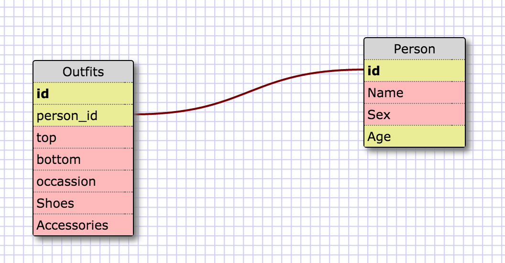

#Database and SQL Reflection

##Release 5: Selecting data from a database

###1. SELECT * FROM states;
###2. SELECT * FROM regions;
###3. SELECT state_name, population FROM states;
###4. SELECT state_name, population FROM states ORDER BY population DESC;
###5. SELECT state_name FROM states WHERE region_id = 7;
###6. SELECT state_name, population_density FROM states WHERE population_density > 50 ORDER BY population_density ASC;
###7. SELECT state_name FROM states WHERE population BETWEEN 1000000 AND 1500000;
###8.SELECT state_name, region_id FROM states ORDER BY region_id ASC;
###9. SELECT region_name FROM regions WHERE region_name LIKE '%Central%';
###10. SELECT regions.region_name, states.state_name FROM regions JOIN states ON regions.id=states.region_id;

##Release 6: Make your own schema

###What are databases for?
####Database are use to organize relational information. It is similar to using spreadsheets, but database allow you to connect different tables to one another that may share some relation.

###What is a one-to-many relationship?
####A one-to-many relationship is when one piece of information relates to many other pieces of information. In the example they use regions and states. Every state belongs to one region, but a region can have many states.

###What is a primary key? What is a foreign key? How can you determine which is which?
####A primary key would be the id of your table. A piece of information that is unique to every row of your table to differentiate it from every other row. A foreign key would be another id, but a piece of information that could be shared amongst various rows. In the example the state table had a region_id column, which could be the same for other states in the table. This foreign key of region_id related to the id in the region table. The id was a primary key in the region table. Each region had it's own id. You could use these to keys to connect the information in the two table together.

###How can you select information out of a SQL database? What are some general guidelines for that?
####If you look above you will see plenty of examples of selecting. It is fairly similar to how you would speak it. You start of by using the SELECT clause, followed by what information you want (either a column, columns, or all columns using *), followed by FROM and the table name.