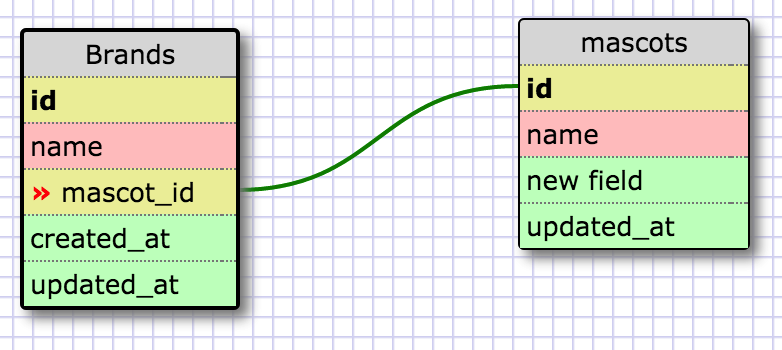
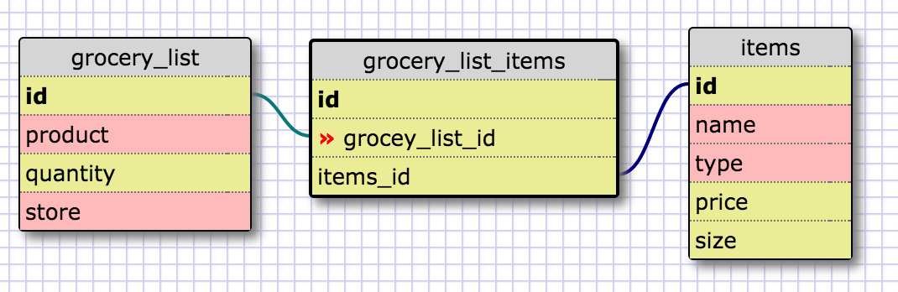

#8.5 More Schemas

##Release 2: Create a One-to-one Schema

##Release 4: Refactor

##Release 6: Reflect

###What is a one-to-one database?
####A one-to-one database is a one where the different table connect based on one similar column or piece of information.

###When would you use a one-to-one database? (Think generally, not in terms of the example you created).
####When you want to simplify your large confusing table into smaller easier to navigate tables that can be linked by similar pieces of information.

###What is a many-to-many database?
####A many-to-many database is one that will associate to categories that could be a property of each other and relates those instances with a join table.

###When would you use a many-to-many database? (Think generally, not in terms of the example you created).
####When you have two properties that could have many items of each other, but not always. It's better to put them in separate databases and then join them when there is overlap.

###What is confusing about database schemas? What makes sense?
####The many to many is a bit confusing and I think I need to see it in use and practice more to really understand.